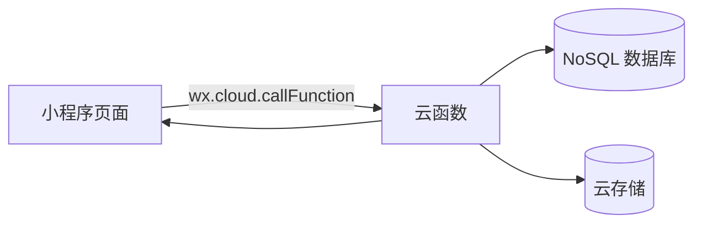

# 现状技术架构（As-Is）

本文档描述代码库当前的真实架构与主要数据流，避免与规划/愿景混写。

## 总览

- 前端：微信小程序原生（WXML/WXSS/JS），通过 `wx.cloud.callFunction` 调用云函数
- 后端：CloudBase 云函数（Node.js），通过 `cloud.getWXContext()` 获取 `OPENID`
- 数据库：CloudBase 文档型数据库（NoSQL），核心集合以 `_openid` 作为用户标识
- 存储：CloudBase 云存储（图片等资源以 `cloud://` 形式保存，前端按需换取临时 URL 展示）

## 目录结构（关键部分）

- `pages/`：小程序页面（用户端与管理员端）
- `cloudfunctions/`：云函数（按功能拆分）
- `utils/`：通用工具（图片 URL 处理等）
- `.trae/documents/`：开发文档（本目录）

## 核心数据模型（集合）

以下为当前代码中明确使用的集合（非穷举），仅描述用途与关键关系：

- `users`：用户主表（包含权限与积分汇总）
  - 关键字段常见用法：`_openid`、`isAdmin`、`totalPoints`、`isOfficialMember`、`exchange_locked`、`trainingStats`
- `point_records`：积分流水（提交/审核/兑换/返还/调整等）
  - 关键字段常见用法：`_openid`、`points`、`status`、`type`、`categoryName`、`submitTime`、`auditTime`
- `products`：商品（库存、尺码库存、上下架等）
- `exchange_records`：兑换记录（状态、物流、消息已读标记等）
- `notifications`：系统消息（仅 `messageManager` 创建 `system` 类消息；审核/兑换类消息从 `point_records` / `exchange_records` 聚合）
- `announcements`：公告（支持首页精选）
- `training_bulletins`：训练公告/简报（含首页展示与参与者）
- `apparel_distributions`：服装发放记录（姓名/手机/地址/类别/尺码/下单/发货等）
- `camp_applications`：训练营报名/审核相关

## 权限与鉴权

- 用户身份：云函数侧通过 `cloud.getWXContext().OPENID` 获取调用者身份
- 管理员校验：大多数管理类云函数通过查询 `users`，判断 `isAdmin === true` 后放行
- 数据隔离：用户侧查询通常以 `_openid === OPENID` 作为条件；管理员查询视云函数实现而定

## 关键业务流（按模块）

### 1) 积分提交与审核

- 用户提交积分：`submitPoints` 写入 `point_records`（待审核）
- 管理员审核：`auditPointRecord` 更新 `point_records.status`，并维护 `users.totalPoints` 与 `users.trainingStats`
- 用户/管理员查询记录：`getPointRecords` / `getPointRecordDetail`（含审核过滤逻辑）

### 2) 商品与兑换

- 商品列表/详情：`getProducts`
- 用户兑换：`exchangeProduct`（事务内扣积分、扣库存、写 `exchange_records` 与 `point_records`）
- 兑换管理与取消：`adminManageExchange`（含 `userCancel` 分支，返还积分并回滚库存，写返还流水）
- 兑换历史：`getExchangeHistory`

### 3) 通知中心

- 聚合消息列表：`messageManager` 读取 `notifications`（system）、`point_records`（audit_result）、`exchange_records`（exchange_status）并统一输出
- 创建系统消息：`messageManager(action=create)`（目前仅允许创建 `system` 类型）

### 4) 公告与训练公告

- 公告读取：`getAnnouncements`
- 公告管理：`adminManageAnnouncements`（含首页展示/精选控制）
- 训练公告：`trainingBulletins`（含首页展示、参与者维护、后台增删改）

### 5) 服装发放

- 管理端列表/新增/更新/删除：`adminManageApparel`
- 前端页面：`pages/admin/apparel/apparel`

### 6) 榜单与统计

- 积分榜：`getLeaderboard`
- 月训练榜：`getTrainingLeaderboard`（优先 users.trainingStats，缺失回退聚合 point_records）
- 统计聚合：`statisticsManager`
- 历史训练统计回填：`backfillTrainingStats`

### 7) 训练营与关注

- 训练营数据：`initCampData`、`getCampData`、`getCampLeaderboard`、`campApplication`
- 关注：`toggleFollow`、`checkFollowStatus`

## 文档对齐约定

- 本文仅描述“已存在的真实实现”；未来规划请写入 ROADMAP.md
- 算法细节只保留在算法文档（例如 训练助手-算法说明.md），其它文档只做链接/摘要

