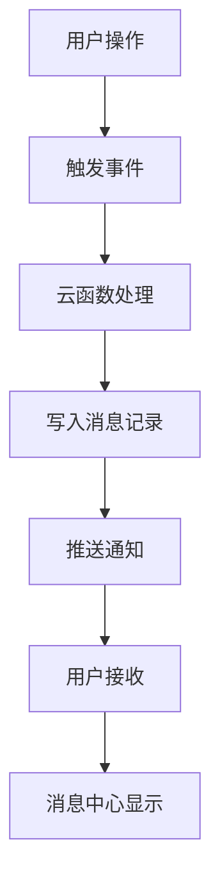

# Phase 3 开发计划 - 界面优化与功能增强

## 1. 项目概述

本阶段将重点完善用户界面、增强交互体验，并添加消息通知和数据统计功能，提升整体产品的专业性和用户体验。

## 2. 核心开发目标

### 2.1 版面完善
- **成员管理页面优化**：调整排版布局，隐藏无关数据串，提升信息展示效率
- **界面紧凑化**：优化空间利用，减少冗余信息显示

### 2.2 消息通知系统
- **积分审核通知**：实时推送积分申请审核结果
- **兑换状态通知**：及时通知商品兑换处理进度
- **系统消息管理**：统一的消息中心界面

### 2.3 数据统计与分析
- **个人积分趋势**：可视化展示用户积分变化曲线
- **俱乐部数据统计**：管理员查看整体运营数据
- **数据图表展示**：使用图表库展示统计信息

### 2.4 高级交互效果
- **动画过渡**：页面切换和状态变化的流畅动画
- **微交互优化**：按钮点击、加载状态等细节交互
- **用户体验提升**：响应式反馈和视觉引导

## 3. 详细实现方案

### 3.1 成员管理页面优化

#### 3.1.1 当前问题分析
通过分析 `pages/admin/members/members.wxml`，发现以下问题：
- **显示完整OpenID**：第42行 `<text class="member-openid">{{item._openid}}</text>` 暴露了完整的用户标识符
- **信息冗余**：用户信息区域占用过多空间
- **布局不够紧凑**：各个模块间距过大，信息密度低

#### 3.1.2 优化方案
1. **隐藏敏感信息**
   - 将完整OpenID替换为脱敏显示（如：`oXXX...XXX`）
   - 仅在必要时显示完整标识符

2. **紧凑化布局**
   - 减少用户信息区域高度
   - 优化积分管理区域布局
   - 调整卡片间距和内边距

3. **信息优先级**
   - 突出显示昵称和积分
   - 弱化次要信息的视觉权重

#### 3.1.3 具体修改内容
```xml
<!-- 优化前 -->
<text class="member-openid">{{item._openid}}</text>

<!-- 优化后 -->
<text class="member-id">ID: {{item._openid.substring(0,8)}}...{{item._openid.substring(item._openid.length-4)}}</text>
```

### 3.2 消息通知系统

#### 3.2.1 系统架构


#### 3.2.2 数据模型设计
```javascript
// 消息表结构 (notifications)
{
  _id: "消息ID",
  _openid: "接收用户OpenID", 
  type: "消息类型(audit_result/exchange_status/system)",
  title: "消息标题",
  content: "消息内容", 
  relatedId: "关联记录ID",
  isRead: false,
  createTime: "创建时间",
  readTime: "阅读时间"
}
```

#### 3.2.3 实现步骤
1. **创建消息管理云函数** (`messageManager`)
2. **修改现有审核和兑换云函数**，添加消息推送逻辑
3. **开发消息中心页面** (`pages/messages/`)
4. **集成小程序订阅消息功能**

### 3.3 数据统计与分析

#### 3.3.1 统计维度
- **个人维度**：积分获取/消费趋势、活跃度分析
- **管理维度**：成员活跃统计、积分流向分析、兑换热度排行

#### 3.3.2 图表组件选择
使用 **ECharts for WeChat** 实现数据可视化：
- 折线图：积分趋势变化
- 柱状图：月度积分统计  
- 饼图：积分来源分布
- 排行榜：活跃用户TOP10

#### 3.3.3 页面结构
```
pages/statistics/
├── personal/          # 个人统计页面
│   ├── personal.js
│   ├── personal.wxml
│   └── personal.wxss
└── admin/            # 管理员统计页面
    ├── admin.js
    ├── admin.wxml
    └── admin.wxss
```

### 3.4 高级交互效果

#### 3.4.1 动画效果清单
- **页面转场**：淡入淡出、滑动切换
- **列表动画**：项目加载的错位动画
- **状态反馈**：按钮点击波纹效果
- **加载动画**：骨架屏和进度指示器

#### 3.4.2 微交互优化
- **触觉反馈**：关键操作添加震动反馈
- **视觉引导**：首次使用的功能引导
- **状态提示**：操作成功/失败的即时反馈

## 4. 开发时间规划

### 4.1 第一周：版面优化
- **Day 1-2**：成员管理页面布局优化
- **Day 3-4**：其他管理页面统一优化
- **Day 5-7**：样式调整和测试

### 4.2 第二周：消息通知系统
- **Day 1-3**：消息数据模型和云函数开发
- **Day 4-5**：消息中心页面开发
- **Day 6-7**：集成订阅消息和测试

### 4.3 第三周：数据统计功能
- **Day 1-2**：统计云函数开发
- **Day 3-4**：个人统计页面开发
- **Day 5-6**：管理员统计页面开发
- **Day 7**：图表集成和优化

### 4.4 第四周：交互效果优化
- **Day 1-3**：动画效果实现
- **Day 4-5**：微交互优化
- **Day 6-7**：整体测试和性能优化

## 5. 技术实现要点

### 5.1 性能优化
- **图片懒加载**：优化头像和商品图片加载
- **数据分页**：大列表采用虚拟滚动
- **缓存策略**：合理使用本地存储缓存数据

### 5.2 用户体验
- **错误处理**：友好的错误提示和重试机制
- **网络适配**：弱网环境下的降级方案
- **无障碍访问**：支持读屏软件和大字体

### 5.3 代码质量
- **组件复用**：提取公共组件和样式
- **代码规范**：统一的命名和注释规范
- **测试覆盖**：关键功能的单元测试

## 6. 验收标准

### 6.1 功能完整性
- ✅ 成员管理页面信息脱敏显示
- ✅ 消息通知系统正常推送
- ✅ 数据统计图表正确展示
- ✅ 动画效果流畅自然

### 6.2 性能指标
- 页面加载时间 < 2秒
- 动画帧率 > 30fps
- 内存使用 < 50MB
- 网络请求响应 < 1秒

### 6.3 用户体验
- 界面布局合理紧凑
- 操作流程简洁直观
- 反馈信息及时准确
- 视觉效果美观统一

## 7. 风险评估与应对

### 7.1 技术风险
- **图表库兼容性**：提前测试ECharts在小程序中的表现
- **动画性能**：避免过度动画影响性能
- **数据量增长**：设计可扩展的数据查询方案

### 7.2 用户体验风险  
- **学习成本**：新功能需要适当的用户引导
- **信息过载**：统计数据展示需要层次分明
- **操作复杂度**：保持功能丰富与操作简单的平衡

### 7.3 应对措施
- 分阶段发布，逐步收集用户反馈
- 建立A/B测试机制，验证设计效果
- 准备回滚方案，确保系统稳定性

---

**文档版本**：v1.0  
**创建时间**：2024年Phase 3开发周期  
**负责团队**：前端开发组 + 产品设计组