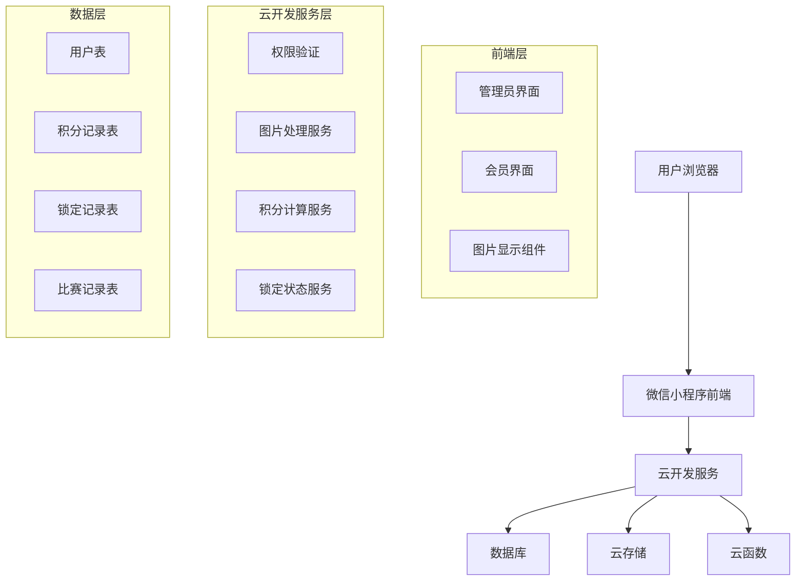

# Phase 4 Technical Architecture Document

## 1. 架构设计

### 1.1 整体架构图



### 1.2 技术栈

- **前端**: 微信小程序原生框架 + WXML/WXSS
- **后端**: 云开发 (CloudBase) + 云函数
- **数据库**: 云开发数据库 (文档型数据库)
- **存储**: 云开发云存储
- **权限管理**: 云开发权限系统

## 2. 数据库设计

### 2.1 用户表 (users) 扩展

```javascript
{
  _id: "user_id",
  openid: "user_openid",
  nickname: "用户昵称",
  avatarUrl: "头像URL",
  points: 100, // 支持负数
  exchange_locked: false, // 兑换锁定状态
  lock_reason: "未参加比赛", // 锁定原因
  locked_at: ISODate("2024-01-01T00:00:00Z"),
  locked_by_admin_id: "admin_id", // 锁定管理员ID
  auto_unlock_date: ISODate("2024-12-31T23:59:59Z"),
  competition_participation_count: 0, // 比赛参与次数
  last_competition_date: ISODate("2024-01-01T00:00:00Z"),
  created_at: ISODate("2024-01-01T00:00:00Z"),
  updated_at: ISODate("2024-01-01T00:00:00Z")
}
```

### 2.2 锁定记录表 (exchange_lock_logs)

```javascript
{
  _id: "log_id",
  user_id: "user_id",
  action: "lock", // lock, unlock
  reason: "未参加比赛",
  performed_by_admin_id: "admin_id",
  created_at: ISODate("2024-01-01T00:00:00Z")
}
```

### 2.3 积分记录表 (point_records) 扩展

```javascript
{
  _id: "record_id",
  user_id: "user_id",
  points: -50, // 支持负数值
  type: "manual_set", // manual_set, earned, redeemed
  reason: "违规扣分",
  admin_id: "admin_id", // 如果是管理员操作
  status: "approved",
  created_at: ISODate("2024-01-01T00:00:00Z")
}
```

### 2.4 比赛记录表 (competition_records)

```javascript
{
  _id: "competition_id",
  name: "2024春季马拉松",
  date: ISODate("2024-04-15T00:00:00Z"),
  participants: ["user_id_1", "user_id_2"],
  status: "completed",
  created_at: ISODate("2024-01-01T00:00:00Z")
}
```

## 3. 云函数设计

### 3.1 图片处理云函数 (processImages)

```javascript
// 云函数入口文件
const cloud = require('wx-server-sdk')
cloud.init({ env: cloud.DYNAMIC_CURRENT_ENV })

exports.main = async (event, context) => {
  const { imageUrls, type = 'avatar' } = event
  
  try {
    // 付费版权限处理
    const processedUrls = await Promise.all(
      imageUrls.map(async (url) => {
        if (url.startsWith('cloud://')) {
          // 使用付费版权限获取临时URL
          const result = await cloud.getTempFileURL({
            fileList: [url]
          })
          
          if (result.fileList && result.fileList[0].status === 0) {
            return result.fileList[0].tempFileURL
          }
        }
        return url
      })
    )
    
    return {
      success: true,
      data: processedUrls
    }
  } catch (error) {
    return {
      success: false,
      error: error.message
    }
  }
}
```

### 3.2 积分管理云函数 (managePoints)

```javascript
// 支持负积分的积分管理
exports.main = async (event, context) => {
  const { userId, points, operationType, reason, adminId } = event
  
  const db = cloud.database()
  
  try {
    // 验证积分范围（支持负数）
    if (points < -1000 || points > 10000) {
      throw new Error('积分范围必须在 -1000 到 10000 之间')
    }
    
    // 更新用户积分
    await db.collection('users').doc(userId).update({
      data: {
        points: points,
        updated_at: new Date()
      }
    })
    
    // 记录积分变动
    await db.collection('point_records').add({
      data: {
        user_id: userId,
        points: points,
        type: operationType,
        reason: reason,
        admin_id: adminId,
        status: 'approved',
        created_at: new Date()
      }
    })
    
    return {
      success: true,
      message: '积分更新成功'
    }
  } catch (error) {
    return {
      success: false,
      error: error.message
    }
  }
}
```

### 3.3 兑换锁定云函数 (manageExchangeLock)

```javascript
// 兑换锁定管理
exports.main = async (event, context) => {
  const { userId, action, reason, adminId } = event
  
  const db = cloud.database()
  
  try {
    if (action === 'lock') {
      // 锁定用户兑换权限
      await db.collection('users').doc(userId).update({
        data: {
          exchange_locked: true,
          lock_reason: reason,
          locked_at: new Date(),
          locked_by_admin_id: adminId,
          updated_at: new Date()
        }
      })
      
      // 记录锁定日志
      await db.collection('exchange_lock_logs').add({
        data: {
          user_id: userId,
          action: 'lock',
          reason: reason,
          performed_by_admin_id: adminId,
          created_at: new Date()
        }
      })
      
    } else if (action === 'unlock') {
      // 解锁用户兑换权限
      await db.collection('users').doc(userId).update({
        data: {
          exchange_locked: false,
          lock_reason: '',
          locked_at: null,
          locked_by_admin_id: '',
          updated_at: new Date()
        }
      })
      
      // 记录解锁日志
      await db.collection('exchange_lock_logs').add({
        data: {
          user_id: userId,
          action: 'unlock',
          reason: reason,
          performed_by_admin_id: adminId,
          created_at: new Date()
        }
      })
    }
    
    return {
      success: true,
      message: action === 'lock' ? '兑换权限已锁定' : '兑换权限已解锁'
    }
  } catch (error) {
    return {
      success: false,
      error: error.message
    }
  }
}
```

### 3.4 自动解锁检测云函数 (checkAutoUnlock)

```javascript
// 自动解锁检测（定时触发）
exports.main = async (event, context) => {
  const db = cloud.database()
  
  try {
    // 查找已锁定且参与过比赛的用户
    const lockedUsers = await db.collection('users')
      .where({
        exchange_locked: true,
        competition_participation_count: _.gt(0)
      })
      .get()
    
    // 批量解锁
    const unlockPromises = lockedUsers.data.map(async (user) => {
      // 检查是否满足解锁条件（参与过比赛）
      if (user.competition_participation_count > 0) {
        await db.collection('users').doc(user._id).update({
          data: {
            exchange_locked: false,
            lock_reason: '自动解锁：已参与比赛',
            locked_at: null,
            locked_by_admin_id: 'system',
            updated_at: new Date()
          }
        })
        
        // 发送解锁通知
        await sendUnlockNotification(user._id)
      }
    })
    
    await Promise.all(unlockPromises)
    
    return {
      success: true,
      unlockedCount: lockedUsers.data.length
    }
  } catch (error) {
    return {
      success: false,
      error: error.message
    }
  }
}
```

## 4. 前端组件设计

### 4.1 负积分输入组件

```javascript
// components/point-input/point-input.js
Component({
  properties: {
    value: {
      type: Number,
      value: 0
    },
    min: {
      type: Number,
      value: -1000 // 支持负数值
    },
    max: {
      type: Number,
      value: 10000
    }
  },
  
  methods: {
    onInputChange(e) {
      const value = parseInt(e.detail.value)
      
      // 验证负数值范围
      if (value < this.properties.min || value > this.properties.max) {
        wx.showToast({
          title: `积分范围必须在 ${this.properties.min} 到 ${this.properties.max} 之间`,
          icon: 'none'
        })
        return
      }
      
      this.triggerEvent('change', { value })
    }
  }
})
```

### 4.2 锁定状态显示组件

```javascript
// components/exchange-lock-status/exchange-lock-status.js
Component({
  properties: {
    isLocked: {
      type: Boolean,
      value: false
    },
    lockReason: {
      type: String,
      value: ''
    },
    showUnlockTip: {
      type: Boolean,
      value: true
    }
  },
  
  methods: {
    onUnlockTipTap() {
      wx.showModal({
        title: '解锁提示',
        content: '参加比赛后即可自动解锁兑换权限',
        showCancel: false
      })
    }
  }
})
```

### 4.3 兑换权限验证

```javascript
// utils/exchangeAuth.js
const checkExchangePermission = async (userId) => {
  try {
    const db = wx.cloud.database()
    
    // 获取用户锁定状态
    const userRes = await db.collection('users').doc(userId).get()
    const user = userRes.data
    
    if (user.exchange_locked) {
      return {
        allowed: false,
        reason: user.lock_reason,
        locked: true
      }
    }
    
    // 检查积分是否足够（支持负积分检查）
    if (user.points < 0) {
      return {
        allowed: false,
        reason: '积分不足，无法兑换',
        locked: false
      }
    }
    
    return {
      allowed: true,
      reason: '',
      locked: false
    }
  } catch (error) {
    return {
      allowed: false,
      reason: '权限检查失败',
      locked: false
    }
  }
}
```

## 5. 权限配置

### 5.1 数据库权限规则

```javascript
// 用户表权限规则
{
  "read": true,
  "write": "doc._openid == auth.openid || auth.admin == true"
}

// 积分记录表权限规则
{
  "read": "doc.user_id == auth.openid || auth.admin == true",
  "write": "auth.admin == true"
}

// 锁定记录表权限规则
{
  "read": "auth.admin == true",
  "write": "auth.admin == true"
}
```

### 5.2 云存储权限规则

```javascript
// 付费版云存储权限配置
{
  "read": true,
  "write": "auth != null"
}
```

## 6. 定时任务配置

### 6.1 自动解锁检测任务

```json
{
  "triggers": [
    {
      "name": "checkAutoUnlock",
      "type": "timer",
      "config": "0 0 2 * * * *", // 每天凌晨2点执行
      "function": "checkAutoUnlock"
    }
  ]
}
```

## 7. 错误处理机制

### 7.1 图片加载错误处理

```javascript
// 增强的图片错误处理
const handleImageError = (imageUrl, errorType) => {
  switch (errorType) {
    case 'STORAGE_EXCEED_AUTHORITY':
      // 付费版权限错误处理
      return {
        fallbackUrl: '/images/default-avatar.png',
        logError: true,
        retry: false
      }
    
    case 'NETWORK_ERROR':
      return {
        fallbackUrl: '/images/default-avatar.png',
        logError: true,
        retry: true,
        maxRetries: 3
      }
    
    default:
      return {
        fallbackUrl: '/images/default-avatar.png',
        logError: true,
        retry: false
      }
  }
}
```

### 7.2 负积分验证错误

```javascript
// 负积分验证
const validateNegativePoints = (points) => {
  const MIN_POINTS = -1000
  const MAX_POINTS = 10000
  
  if (points < MIN_POINTS) {
    throw new Error(`积分不能低于 ${MIN_POINTS}`)
  }
  
  if (points > MAX_POINTS) {
    throw new Error(`积分不能超过 ${MAX_POINTS}`)
  }
  
  return true
}
```

## 8. 性能优化

### 8.1 图片缓存策略

```javascript
// 付费版图片缓存优化
const imageCache = {
  // 缓存配置
  maxAge: 7 * 24 * 60 * 60 * 1000, // 7天
  maxSize: 100, // 最大缓存100张图片
  
  // 缓存键生成
  generateKey: (url) => {
    return `img_${url.hashCode()}`
  },
  
  // 缓存清理
  cleanup: () => {
    const now = Date.now()
    // 清理过期缓存
    Object.keys(cache).forEach(key => {
      if (cache[key].timestamp + maxAge < now) {
        delete cache[key]
      }
    })
  }
}
```

### 8.2 数据库索引优化

```javascript
// 关键索引创建
{
  "collectionName": "users",
  "indexes": [
    { "fields": ["exchange_locked"], "name": "idx_exchange_locked" },
    { "fields": ["competition_participation_count"], "name": "idx_competition_count" },
    { "fields": ["points"], "name": "idx_points" }
  ]
}
```

## 9. 监控与日志

### 9.1 业务监控指标

```javascript
// 关键指标监控
const metrics = {
  // 图片加载成功率
  imageLoadSuccessRate: 0,
  
  // 负积分操作频率
  negativePointOperations: 0,
  
  // 锁定状态变更
  lockStatusChanges: 0,
  
  // 自动解锁成功率
  autoUnlockSuccessRate: 0
}
```

### 9.2 错误日志记录

```javascript
// 增强的错误日志
const logError = (error, context) => {
  const logData = {
    timestamp: new Date(),
    error: error.message,
    stack: error.stack,
    context: context,
    userAgent: getUserAgent(),
    environment: getEnvironment()
  }
  
  // 发送到云开发日志服务
  wx.cloud.callFunction({
    name: 'logError',
    data: logData
  })
}
```

这个技术架构文档详细描述了Phase 4三个核心功能的技术实现方案，包括数据库设计、云函数实现、前端组件设计、权限配置、性能优化和监控机制，为开发团队提供了完整的技术指导。